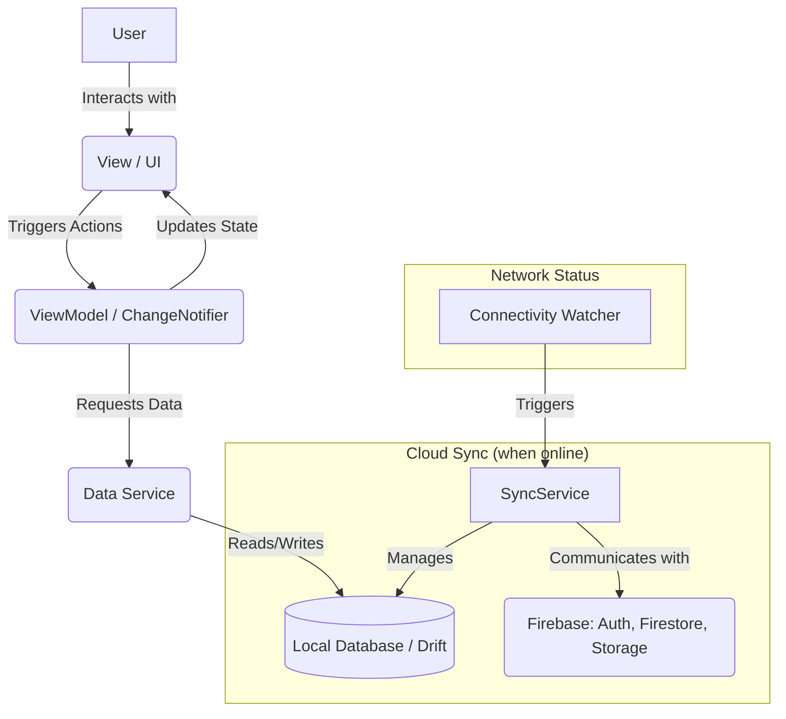
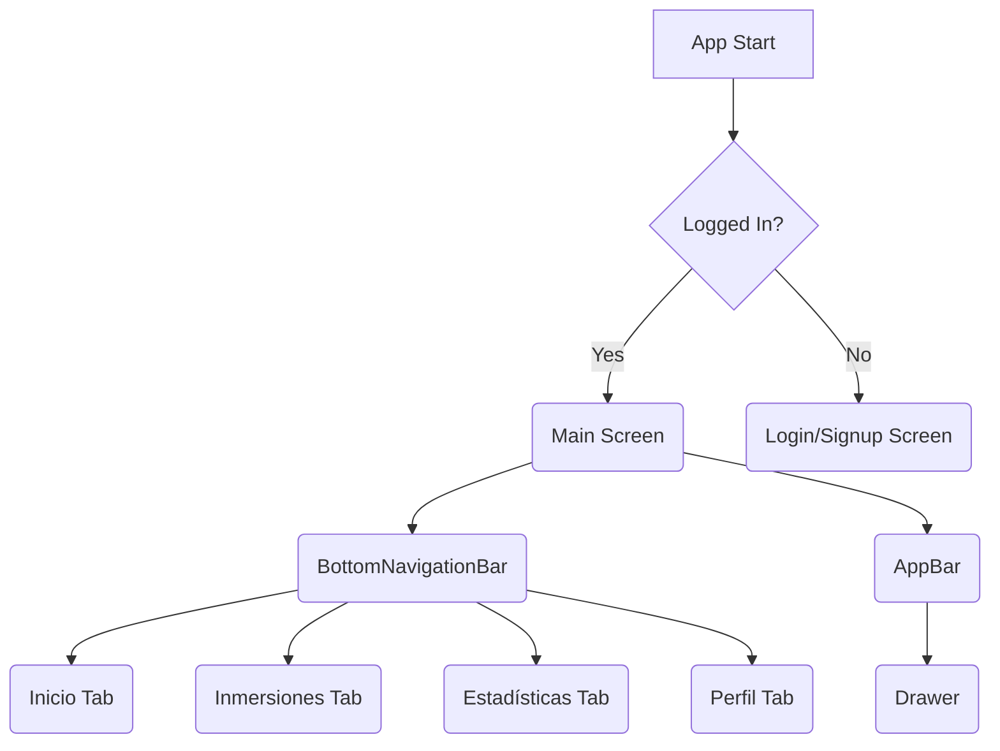

# Design of the "Dive Log" Mobile Application

## 1. Overview

This document details the design of a Flutter mobile application called "Dive Log". The main purpose of the application is to allow divers to digitally record and manage their dive sessions, as well as export reports of each session in PDF format.

This is an **offline-first** application. All data is written to a local on-device database first, ensuring the app is fully functional without an internet connection. When a connection is available, the app will synchronize the local data with a cloud backend on **Firebase**. User authentication will be managed by **Firebase Authentication**, dive log data will be synced to **Cloud Firestore**, and generated PDFs will be backed up to **Firebase Storage**.

## 2. Problem/Objective Analysis

The goal is to create a robust and reliable digital logbook that works anywhere, even in remote dive locations with no internet.

*   **Offline Functionality:** The app must be fully operational offline. Users can create, read, update, and delete dive logs without a connection.
*   **Cloud Synchronization:** When online, data is automatically backed up and synchronized across the user's devices.
*   **Authentication:** Secure user accounts to keep dive logs private and accessible.
*   **Detailed Logging, Organization, and Reporting:** Core functionalities remain the same.

### Key Functional Requirements:

*   **Offline-First:** All core CRUD (Create, Read, Update, Delete) operations must work offline.
*   **Authentication:** Users must be able to sign up and log in.
*   **Cloud Sync:** Data should sync with the cloud when a connection is available.
*   **Language:** The entire user interface must be in Spanish.
*   **Session Log Fields:** (Fields remain the same as previously listed).
*   **PDF Export:** Ability to export each individual dive session as a PDF.
*   **Navigation & Filtering:** (Requirements remain the same).

## 3. Alternatives Considered

### 3.1. Data Persistence Architecture

*   **Cloud-First (Original Proposal):** This approach uses a cloud database as the primary source of truth. While it simplifies multi-device sync, it offers limited offline capabilities and was not suitable for the requirement of full offline functionality.
*   **Offline-First (New Proposal):** This approach uses a local database as the primary source of truth. It provides a robust offline experience. A separate synchronization layer handles communication with the cloud backend. This architecture is more complex but meets all user requirements.

    **Decision:** We will adopt an **Offline-First** architecture. **Drift (SQLite)** will be used for the local database, and **Cloud Firestore** will serve as the cloud backend for synchronization.

### 3.2. PDF Generation, Authentication, and File Storage

*   **PDF Generation:** `pdf` and `printing` packages.
*   **Authentication:** `Firebase Authentication`.
*   **Cloud File Storage:** `Firebase Storage`.

    **Decision:** The decisions for these components remain unchanged.

## 4. Detailed Design

### 4.1. Application Architecture

The architecture is **MVVM (Model-View-ViewModel)** with a dedicated `SyncService` to handle data synchronization. The `DataService` will now exclusively interact with the local `Drift` database, making the ViewModels unaware of the cloud backend.



#### 4.1.1. State Management (ChangeNotifier and Provider)

(This section remains the same, explaining the use of `ChangeNotifier` and `provider`.)

### 4.2. Data Structure (Models)

The `Drift` table definition will be updated to include fields necessary for synchronization.

```dart
// lib/data/database/tables/dive_sessions.dart
import 'package:drift/drift.dart';

// Enum for sync status
enum SyncStatus { synced, pending, failed }

class SyncStatusConverter extends TypeConverter<SyncStatus, int> {
  const SyncStatusConverter();
  @override
  SyncStatus fromSql(int fromDb) => SyncStatus.values[fromDb];
  @override
  int toSql(SyncStatus value) => value.index;
}

@DataClassName('DiveSession')
class DiveSessions extends Table {
  IntColumn get id => integer().autoIncrement()();
  TextColumn get firestoreId => text().nullable().unique()(); // Firebase document ID
  
  // Sync status fields
  IntColumn get syncStatus => integer().map(const SyncStatusConverter()).withDefault(const Constant(1))(); // Default to 'pending'
  DateTimeColumn get updatedAt => dateTime().withDefault(currentDateAndTime)();
  
  // All other DiveSession fields remain here...
  TextColumn get client => text()();
  TextColumn get diveOperator => text()();
  // etc...
}
```

### 4.3. Data Persistence and Synchronization

#### 4.3.1. Local Database (Drift)

*   **Source of Truth:** The `Drift` database is the single source of truth for the application's UI. All data is read from and written to it directly.
*   **DAO (Data Access Objects):** The `DataService` will use DAOs generated by `Drift` to perform CRUD operations on the local database.

#### 4.3.2. Cloud Sync Target (Firebase)

*   **Firestore:** Serves as the cloud backup. The data structure will mirror the local model: `users/{userId}/dive_sessions/{firestoreId}`.
*   **Firebase Storage:** Stores generated PDFs.

#### 4.3.3. Synchronization Service

A `SyncService` will run in the background to manage the synchronization logic.

*   **Network Monitoring:** It will use the `connectivity_plus` package to listen for network status changes. When the device comes online, it will trigger the sync process.
*   **Upload Logic:**
    1.  Query the local `Drift` database for all records with `syncStatus` = `pending`.
    2.  For each pending record:
        *   If it doesn't have a `firestoreId`, create a new document in Firestore.
        *   If it has a `firestoreId`, update the existing document in Firestore.
    3.  On successful upload, update the local record's `syncStatus` to `synced` and store the `firestoreId` if it was a new record.
*   **Download Logic:**
    1.  Fetch records from Firestore that have been updated since the last sync timestamp.
    2.  For each incoming record:
        *   Check if a local record with the corresponding `firestoreId` exists.
        *   If it exists, compare the `updatedAt` timestamps. If the remote record is newer, update the local one.
        *   If it doesn't exist, create a new local record.
*   **Conflict Resolution:** A "last write wins" strategy will be used based on the `updatedAt` timestamp. The record (local or remote) with the newer timestamp will be considered the source of truth during a sync conflict.

#### 4.3.4. Offline Authentication

A critical aspect of an offline-first app is how it handles user sessions without an internet connection. Firebase Authentication is designed to manage this securely and efficiently.

*   **Token Caching:** When a user signs in for the first time (which requires an internet connection), the Firebase Authentication SDK securely caches the user's ID token on the device.
*   **Offline Persistence:** On subsequent app launches, Firebase uses this cached token to restore the user's authentication state automatically, without needing a network request. This means a previously logged-in user remains authenticated even when offline.
*   **Local Data Access:** The user's unique ID (`uid`) is available while offline. This is essential, as it allows the app to continue associating new or modified local data with the correct user account, ready for synchronization later.
*   **Online-Only Operations:** Actions that modify a user's security profile or create a new user will still require an internet connection. These include:
    *   New user registration (sign-up).
    *   First-time sign-in.
    *   Password resets.
    *   Re-authenticating after a prolonged offline period (if the cached token expires).
*   **Graceful Handling:** The application UI will check for network connectivity before initiating any of these online-only authentication actions and will provide appropriate feedback to the user if they are offline.

### 4.4. User Interface (UI) and Navigation

The application will feature a modern, clean, and intuitive design based on **Material 3** principles. The UI will be responsive and provide a consistent experience across different device sizes.

#### 4.4.1. Theming and Styling

*   **Color Scheme:** A color palette will be generated using `ColorScheme.fromSeed` with a primary color (e.g., a shade of blue to evoke the sea). The app will support both **Light and Dark themes** automatically based on system settings, with an option for the user to override this in their profile.
*   **Typography:** The `google_fonts` package will be used to provide a clean and readable font (e.g., 'Roboto' or 'Lato') for all text elements. A clear typographic hierarchy will be established for titles, subtitles, and body text.
*   **Icons:** Material icons will be used throughout the app for clarity and consistency.

#### 4.4.2. Main Navigation Structure

Navigation will be handled by the `go_router` package. The main screen of the app will be a `Scaffold` containing a `BottomNavigationBar` and a `Drawer`.

*   **Bottom Navigation Bar:** This will be the primary method of navigating between the four main sections of the app:
    *   **Inicio (Home):** Icon `Icons.home`
    *   **Inmersiones (Dives):** Icon `Icons.scuba_diving`
    *   **Estadísticas (Statistics):** Icon `Icons.bar_chart`
    *   **Perfil (Profile):** Icon `Icons.person`
*   **Navigation Drawer:** Accessible from the `AppBar`, the drawer will provide access to secondary features and actions:
    *   User's name and email.
    *   Settings screen.
    *   "About" screen.
    *   A "Logout" button.



#### 4.4.3. Screen-by-Screen Breakdown

*   **Authentication Screens (Login/Signup):**
    *   Simple, clean forms with fields for email and password.
    *   Will include options for social sign-in (e.g., "Sign in with Google").
    *   Clear error messaging for incorrect credentials or network issues.

*   **Inicio (Home) Tab:**
    *   A welcoming "Hola, [Nombre de Usuario]" message.
    *   A summary section with key statistics presented in `Card` widgets (e.g., "Total Inmersiones", "Tiempo Total de Fondo").
    *   A prominent **FloatingActionButton (FAB)** with an `Icons.add` icon to navigate the user to the Dive Log Form to create a new session.

*   **Inmersiones (Dives) Tab:**
    *   An `AppBar` with the title "Inmersiones". It will contain an `IconButton` for search, which animates to reveal a `TextField`, and another `IconButton` for filtering.
    *   The main body will be a `ListView.builder` for performance, showing a list of `DiveSessionCard` widgets. If the list is empty, a message like "No has registrado ninguna inmersión todavía. ¡Presiona '+' para empezar!" will be displayed.
    *   **`DiveSessionCard`:** A custom widget that neatly displays the most important information for a dive at a glance (e.g., `lugarDeBuceo`, `fecha`, `maximaProfundidad`, `tiempoDeFondo`). Each card will be tappable, navigating to a read-only detail screen for that dive.
    *   **Filter UI:** Tapping the filter icon will open a modal bottom sheet with options to filter by date, date range, dive site, and operator.

*   **Dive Detail Screen:**
    *   A read-only view of a single dive session, displaying all its fields in a well-organized layout.
    *   The `AppBar` will have an "Edit" action to navigate to the form screen with the data pre-filled, and an "Export to PDF" action.

*   **Dive Log Form (New/Edit Screen):**
    *   A `Scaffold` with an `AppBar` titled "Nueva Inmersión" or "Editar Inmersión".
    *   The body will be a `SingleChildScrollView` containing a `Form` widget to prevent overflow.
    *   Fields will be grouped logically into sections using `Card` widgets or headers (e.g., "Información General", "Detalles de la Sesión").
    *   **Input Controls:**
        *   `TextFormField` for text inputs, with appropriate `InputDecoration` (labels, hints in Spanish), `keyboardType`, and validation.
        *   `DropdownButtonFormField` for `Tipo de Buceo`.
        *   Date and time pickers will be invoked for all date/time fields.
        *   `CheckboxListTile` for boolean fields like `Inicio de Descompresión`.
    *   A prominent "Guardar" (Save) button at the bottom.

*   **Estadísticas (Statistics) Tab:**
    *   Will use a charting library like `fl_chart`.
    *   Will feature several charts in a `GridView` or `ListView`, such as a bar chart showing dives per month and a line chart showing the progression of max depth over time.

*   **Perfil (Profile) Tab:**
    *   Display user information (name, email).
    *   A toggle switch for Light/Dark/System theme selection.
    *   A "Logout" button that clears user session data and navigates to the login screen.

### 4.5. PDF Generation and Export

*   PDF generation logic is unchanged.
*   The generated PDF will be saved to the device's local file system first.
*   A `localPdfPath` will be stored in the local `Drift` database record.
*   The `SyncService` will be responsible for uploading the PDF from this local path to **Firebase Storage** when a connection is available and then updating the `pdfUrl` field in Firestore.

### 4.6. Search and Filtering

*   All search and filter queries will be executed against the local **Drift** database. This ensures the functionality is fast and always available, regardless of network connectivity.

## 5. Design Summary

The revised design establishes an **offline-first architecture**, which is robust and user-friendly for a mobile application used in varying connectivity conditions. It uses a local **Drift (SQLite)** database as the primary source of truth for a responsive and always-available UI. A background **`SyncService`** handles the crucial task of synchronizing the local data with the **Firebase** backend (Firestore and Storage) when the device is online, providing a seamless cloud backup and multi-device experience.

## 6. References

(References remain the same, with the addition of `connectivity_plus`.)
*   **Connectivity Plus:** [https://pub.dev/packages/connectivity_plus](https://pub.dev/packages/connectivity_plus)
*   **Firebase for Flutter:** [https://firebase.flutter.dev/](https://firebase.flutter.dev/)
*   ... (other references) ...